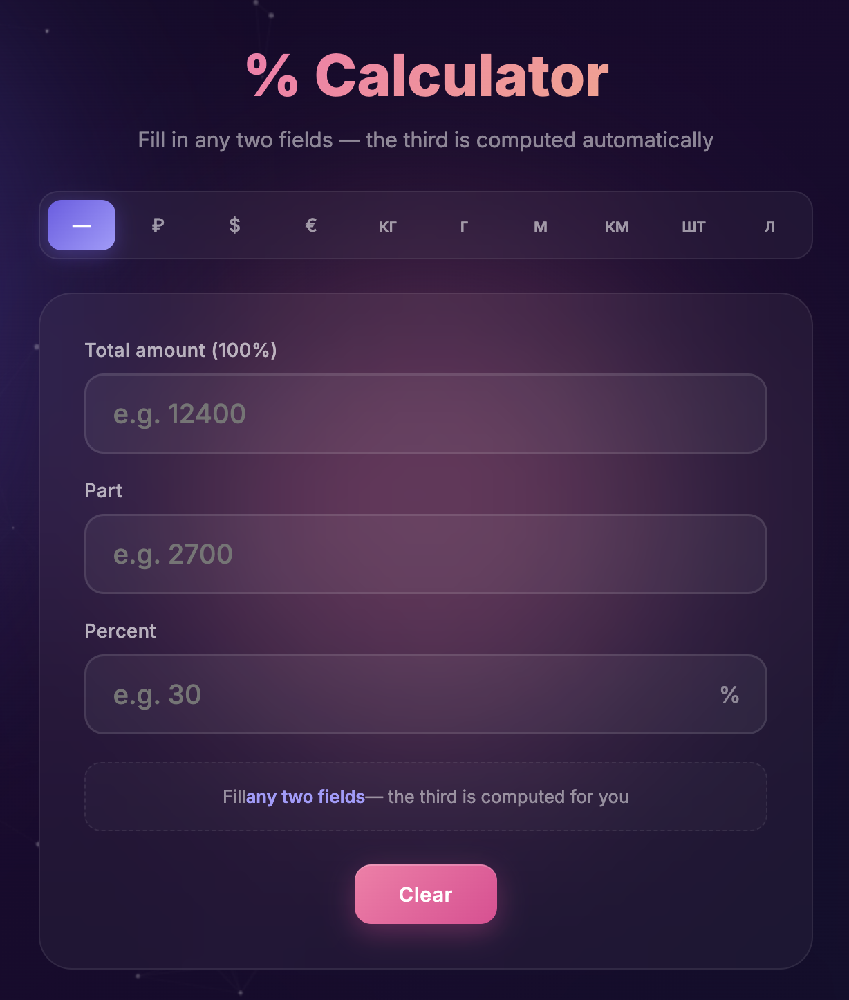

<p align="center">
  <a href="README.md"></a>
  <a href="README.en.md"></a>
</p>

<p align="center">
  
</p>

# Калькулятор процентов

Современный веб-калькулятор процентов с анимированным фоном, поддержкой разных единиц измерения (₽, $, €, кг, г, м, км, шт, л) и переключением языков (RU/EN).

## Возможности

- Расчёт процентов в обе стороны (сколько процентов от числа и наоборот)
- 9 единиц измерения на выбор
- Двуязычный интерфейс (русский / английский)
- Красивый анимированный фон с частицами и градиентами
- Адаптивный дизайн для мобильных устройств
- Работает полностью на клиенте — без бэкенда

## Технологии

- HTML5
- CSS3 (анимации, градиенты, адаптив)
- Vanilla JavaScript
- Google Fonts (Inter)

## Запуск локально

Достаточно открыть файл `index.html` в любом современном браузере:

```bash
open index.html
```

Или запустить простой локальный сервер:

```bash
python3 -m http.server 8000
```

После чего открыть [http://localhost:8000](http://localhost:8000).

## Деплой

Проект размещён через **GitHub Pages** и не требует сборки — это статический HTML-файл.

## Лицензия

MIT
