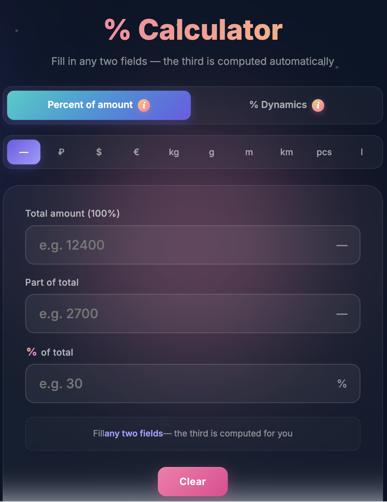
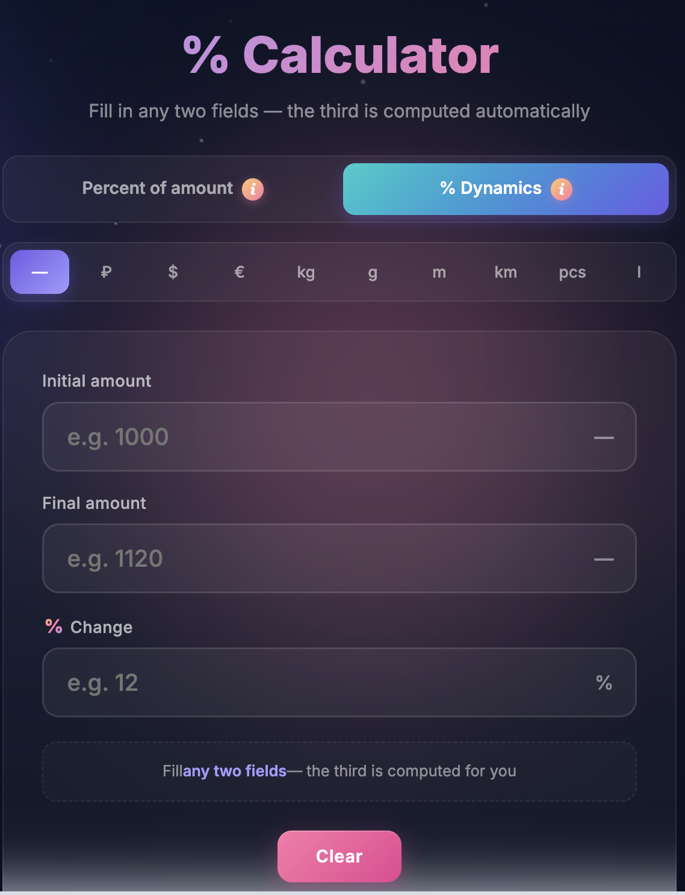

<h1 align="center">Калькулятор % · Percent Calculator</h1>

<p align="center">
  <a href="#-русский"></a>
  <a href="#-english"></a>
</p>

<p align="center">
  
  &nbsp;
  
</p>

<p align="center">
  <a href="https://kostanian.github.io/percent-calculator/"><b>🚀 Открыть демо / Live Demo</b></a>
</p>

---

## 🇷🇺 Русский

Современный веб-калькулятор процентов с двумя режимами, анимированным фоном, поддержкой разных единиц измерения и переключением языков (RU/EN).

### Возможности

- **Две вкладки-калькулятора:**
  - **Процент от суммы** — находит часть, полную сумму или процент. Пример: «сколько 30% от 12 400» или «2700 — это какой процент от 12 400».
  - **Динамика в %** — вычисляет процент роста или падения между двумя значениями. Пример: было 1000, стало 1120 — рост на 12% 📈.
- Логика автозаполнения: заполняешь **любые два поля** — третье считается автоматически.
- Динамические подписи в названиях полей с подстановкой введённых значений, например: `Процент от полной суммы (2700 из 12400)`.
- 9 единиц измерения на выбор: ₽, $, €, кг, г, м, км, шт, л (единицы локализуются в английской версии).
- Двуязычный интерфейс (русский / английский) с сохранением выбора в localStorage.
- Информационные попапы (`i`-иконки на вкладках) с описанием каждого режима.
- Иконки тренда 📈 / 📉 при расчёте динамики.
- Цифровая клавиатура на мобильных (`inputmode="decimal"`), запятая и точка как десятичный разделитель.
- Красивый анимированный фон с градиентами и частицами.
- Адаптивный дизайн — всё работает на телефонах.
- Полностью клиентское приложение — без бэкенда и зависимостей.

### Технологии

- HTML5 · CSS3 (анимации, градиенты, backdrop-filter) · Vanilla JavaScript
- Google Fonts (Inter)

### Запуск локально

```bash
# Вариант 1: просто открыть файл
open index.html

# Вариант 2: локальный сервер
python3 -m http.server 8000
# затем открыть http://localhost:8000
```

### Деплой

Проект размещён через **GitHub Pages** и не требует сборки — это один статический HTML-файл.

### Лицензия

MIT

---

## 🇬🇧 English

A modern web-based percent calculator with two modes, animated background, multiple measurement units and a language switcher (RU/EN).

### Features

- **Two calculator tabs:**
  - **Percent of amount** — finds the part, the total, or the percent. Example: "what is 30% of 12,400" or "2700 is what percent of 12,400".
  - **% Dynamics** — computes the percent change (growth or drop) between two values. Example: was 1000, became 1120 → +12% 📈.
- Auto-fill logic: enter **any two** fields — the third is computed automatically.
- Dynamic inline hints in field labels with actual entered values, e.g. `Percent of total (2700 of 12400)`.
- 9 measurement units: ₽, $, €, kg, g, m, km, pcs, l (units localized in EN mode).
- Bilingual UI (Russian / English), preference persisted in localStorage.
- Info popovers (`i` icons on tab bar) explaining each mode.
- Trend icons 📈 / 📉 when computing dynamics.
- Mobile numeric keypad (`inputmode="decimal"`), comma or dot accepted as decimal separator.
- Beautiful animated background with gradients and particles.
- Responsive design — works great on phones.
- Fully client-side — no backend, no dependencies.

### Tech Stack

- HTML5 · CSS3 (animations, gradients, backdrop-filter) · Vanilla JavaScript
- Google Fonts (Inter)

### Running Locally

```bash
# Option 1: just open the file
open index.html

# Option 2: local server
python3 -m http.server 8000
# then open http://localhost:8000
```

### Deployment

Hosted via **GitHub Pages** — no build step required, just a single static HTML file.

### License

MIT
